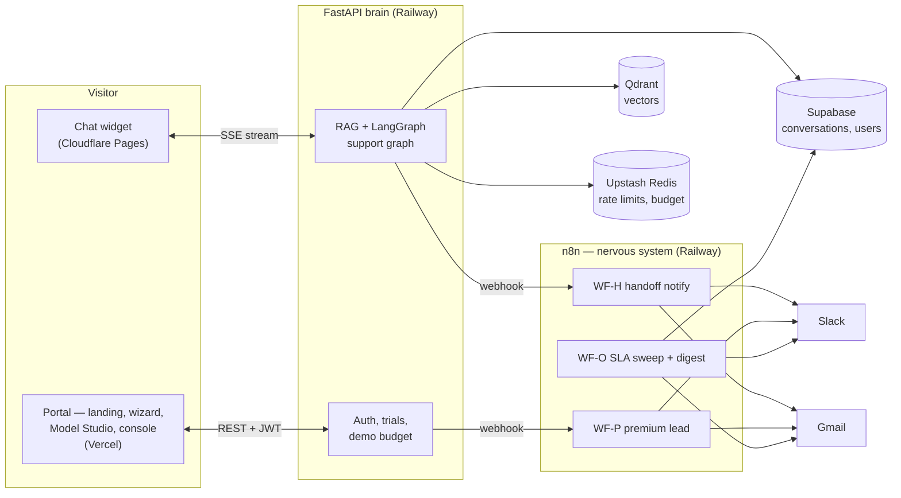

# HelpFlow

**An AI customer-support agent that knows when to get a human.**

Point it at your website. It crawls the pages, answers customer questions **with
citations** back to your own content, and — this is the part that matters — when it
isn't confident, or a customer asks for a refund, or just says "let me talk to a
person," it **hands off instead of guessing**. A human takes over the live
conversation from an agent inbox, in the same chat window the customer is already in.
An owner dashboard shows the deflection rate and a "gap report" of the questions your
docs don't answer yet.

**Try it right now, free, in about 2 minutes** — no credit card, and if you don't even
want to get your own API key, it runs on a shared free-tier demo mode out of the box.

🔗 **Live portal:** `<PORTAL_URL>` · **Live widget demo:** `<WIDGET_DEMO_URL>`


*A customer asks something the AI shouldn't guess at → Slack ping → an agent claims
it → the reply lands live in the same widget window. Capture steps in
`docs/runbook.md` §12.*

---

## The two things this project proves

**1. It won't lie to your customers.** Grounded-or-handoff is not a feature toggle —
it's the architecture. The escalation decision is a deterministic function, not an LLM
call (see [Ethics & safety](#ethics--safety-grounded-or-handoff) below), so it can't be
prompted around, and it's covered by tests, not vibes.

**2. You can try it on your own site before you trust me with a dollar.** Register,
paste a URL, watch it crawl, chat with it — all before you've entered a card number or
even an API key. If you want your own model instead of the shared demo pool, your key
never leaves your browser (see [BYOK trust](#byok-trust-your-key-never-touches-my-server)).

## Three tiers, honestly explained

| Tier | Whose key / cost | Models | Who it's for |
|---|---|---|---|
| **Demo mode** (default) | Mine — shared free-tier Groq + OpenRouter keys, ₹0 | Free open-source only (Llama 3.3 70B, Nemotron) | "Just let me try it" |
| **Free BYOK** | Yours — a free Groq/OpenRouter key, no card | Curated open-source catalog (Nemotron 3, GPT-OSS, Gemma 4, Qwen3) | Want your own quota, still ₹0 |
| **Paid BYOK** | Yours — OpenRouter/OpenAI/Gemini/Anthropic | Full picker, incl. Claude/GPT-5 | Production-grade answers on your own billing |

Every account gets **2 trial workspaces**, no strings, enforced server-side. Want a
third, or a managed deployment for your business → the app asks you to talk to me
(LinkedIn / WhatsApp / email — the same "premium gate" that generates my leads, see
[CASE-STUDY.md](CASE-STUDY.md)).

## Architecture at a glance



Two backends, one thin webhook boundary (`docs/ARCHITECTURE.md` §2):

- **FastAPI brain** (`backend/`) — RAG retrieval, streaming grounded answers, the
  escalation *decision* (deterministic, no LLM), auth/trials/demo-budget, and the
  conversation store. Anything real-time or transactional.
- **n8n nervous system** (`workflows/`, `snippets/`) — human-agent alerts, business
  hours, the hourly SLA sweep + daily ops digest, premium-lead notify, (optional)
  WhatsApp. Anything "when X, notify/route" — n8n never makes an LLM call.

Stores: **Qdrant** (vectors, tenant-filtered at one choke point) · **Supabase Postgres**
(conversations, the guarded stage machine, RLS-masked views the console reads directly)
· **Upstash Redis** (`hf:` rate limits, demo-budget counters). Models: **LangChain +
LangGraph** — provider construction lives in exactly one file
(`backend/llm/factory.py`), every agent calls through one gateway
(`backend/llm/gateway.py`), the conversation flow is a `StateGraph`
(`backend/graph/support_graph.py`).

## Ethics & safety: grounded-or-handoff

This is the non-negotiable core (`docs/ARCHITECTURE.md` §5.6), and it's why the demo is
built to be poked at, not just watched:

- **The escalation decision is deterministic — not an LLM call.** It fires on: the
  route model says "handoff," the best retrieved chunk scores below
  `RELEVANCE_THRESHOLD`, or two consecutive low-confidence turns. None of that runs
  through a prompt that could be argued with.
- **Sensitive intents always reach a human** — refunds, complaints, cancellations,
  explicit requests — tenant-configurable, never silently dropped.
- **The AI never talks over a human.** Once a conversation is `human_assigned`, the AI
  produces zero output until the human hands it back.
- **PII is masked on every dashboard view** — customer emails render as `j***@x.com` in
  the console; row-level security means there's no other read path for the anon key.
- **It never impersonates a human.** The handoff message says so explicitly.

## BYOK trust: your key never touches my server

The honest, slightly uncomfortable truth about bring-your-own-key demos: most of them
say "your key is safe" and then log it somewhere. This one doesn't, and the reason is
architectural, not a promise:

- Your key lives in **your browser's localStorage**. It's sent per-request as an
  `X-LLM-Key`/`X-Embed-Key` header, parsed in exactly one file
  (`backend/llm/runconfig.py`), and never written to a database, a log line, or an
  error message. There's a test that greps for exactly this.
- `POST /api/models/validate` does a real 1-token probe so you see "key works ✓"
  before you commit to it — no blind trust either direction.
- **The honest limitation** (this is §4.4 of the architecture doc, and it's here
  because a limitations section that only lists comfortable limitations isn't one):
  BYOK covers *your own browser session* — the portal preview, your own testing. A
  widget embedded on someone else's website, or a WhatsApp conversation, has no
  browser to hold a key in, so those always run demo mode. A real production
  deployment would need a server-side key vault (Supabase Vault / KMS) to let an
  embedded widget use the owner's key safely — deliberately out of scope here, because
  "your key never leaves your browser" is a stronger trust story for a public demo than
  "trust my vault."

## Real, measured numbers

Filled in from the live production traces in `docs/runbook.md` §11 — not
estimates. *(Placeholders below are replaced the first time the full loop is run
against the deployed URLs; nothing here ships invented.)*

| Metric | Value | How it was measured |
|---|---|---|
| Time to first token (TTFT), demo mode | `<TBD>` ms | `curl -N` timing on `/chat/stream`, runbook §1.2 |
| Crawl time, 25-page trial site | `<TBD>` s | Wizard SSE progress, wall-clock |
| Cold-visitor → chatting on their own site | `<TBD>` min | Timed incognito walkthrough, E8 acceptance |
| Deflection rate, seeded demo tenant | `<TBD>` % | `v_funnel` view after a real conversation batch |
| Demo-mode daily cost | ₹0 | Free-tier keys only, budget-capped — by construction, not measurement |

## Screenshots

- [ ] Model Studio — provider cards + live key test (`docs/assets/model-studio.png`)
- [ ] Gap Report — theme frequency + example questions (`docs/assets/gap-report.png`)
- [ ] Console inbox — claimed conversation, live reply (`docs/assets/inbox.png`)
- [ ] Escalation → takeover GIF (top of this README, `docs/assets/takeover.gif`)

*(Capture checklist: `docs/runbook.md` §12. Drop files in `docs/assets/` and swap these
checkboxes for `` embeds.)*

## Honest limitations

- **BYOK doesn't cover embedded/WhatsApp traffic** — see [BYOK trust](#byok-trust-your-key-never-touches-my-server)
  above (§4.4). A real vault is the fix; deliberately not built here.
- **One global business-hours window**, not per-tenant — every tenant shares
  `$env.BUSINESS_HOURS`/`$env.BUSINESS_TZ`. Fine for a single-operator demo; a real
  multi-tenant SaaS would move this into the schema.
- **The demo-mode model lineup is Raj's editorial pick**, refreshed periodically by
  hand (`backend/llm/catalog.py`) — not a live-scraped, always-current leaderboard.
- **No re-crawl-with-a-different-embedding-model UI yet.** The backend returns a clean
  409 (`embed_mismatch`) if you try, but the "start over" flow the error message
  describes doesn't have a screen — you'd re-create the workspace today.
- **Gap clustering is a batch job**, not real-time — `backend/scripts/cluster_gaps.py`
  runs on demand/cron, not on every escalation.

## Try it locally

Quick reference — commands only, assumes accounts already exist:

```bash
python -m venv .venv && source .venv/bin/activate
pip install -r requirements.txt
cp .env.example .env          # fill in the blanks — see the comment on every var

uvicorn backend.main:app --reload      # → http://localhost:8000/health
pytest                                 # unit tests (external services mocked)
ruff check .

python -m backend.scripts.create_collection            # idempotent Qdrant setup
SUPABASE_DB_URL=... scripts/apply-sql.sh --assert       # schema + views + RLS + assertions

cd widget && npm install && npm run dev      # chat widget, Vite dev server
cd portal && npm install && npm run dev      # landing/wizard/console, Next.js dev server
```

**First time, or want to see it working end-to-end with real sample data?**
[`SETUP.md`](SETUP.md) is the full walkthrough — free-account signup links, a seeded
demo tenant with real crawled content, and a step-by-step tour of the widget, wizard,
Model Studio, and console.

Full production deploy (Railway/Vercel/Cloudflare/UptimeRobot, numbered checklists):
[`docs/runbook.md`](docs/runbook.md).

## Repository layout

```
backend/    FastAPI brain — llm/ (BYOK factory+gateway), graph/ (LangGraph), agents/,
            ingestion/, api/, services/ (trials, demo budget), prompts/, tests/
sql/        001-006 migrations · assert_*.sql
scripts/    apply-sql.sh · export-workflows.mjs · check-sync.mjs
workflows/  wf-handoff · wf-premium-lead · wf-ops (n8n exports)
snippets/   n8n Code-node JS — source of truth, checked against workflows/ by check-sync.mjs
widget/     embeddable chat bubble (React + Vite)         portal/  Next.js 14 — landing,
                                                                     wizard, Model Studio, console
docs/       ARCHITECTURE.md · BUILD-PROMPTS.md · specs/ · runbook.md · CASE-STUDY.md · LOOM-SCRIPT.md
```

## The reuse story

HelpFlow is deliberately built from pieces of the other two projects in this portfolio,
not from scratch — see [CASE-STUDY.md](CASE-STUDY.md) for the full story of how a RAG
engine, an orchestration pattern, and a BYOK layer, each proven once, composed into a
product that now generates its own leads.

---

Built by Raj — freelance AI/automation engineer specializing in production RAG systems
and AI agents. LinkedIn / WhatsApp / email links live on the portal's premium gate.
